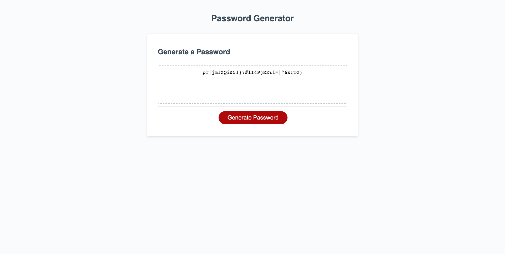

# Password Generator

This project is a Password Generator that allows the user to generate secure passwords by selecting from customizable criteria. The user is presented with a series of prompts to choose from that will generate a secure password. The criteria includes the options of password length, lowercase letters, uppercase letters, numbers, and special characters. Based on the user's choices, the generator creates a random password that matches the selected criteria.

The purpose of this project is to provide users with a tool to generate strong and unique passwords, which are essential for maintaining online security.

## Technologies Used

- HTML
- CSS
- JavaScript

## Features

- Password Length: The user is prompted to enter the desired length of the password. The length must be between 8 and 128 characters.
- Password Criteria: The user is presented with a series of prompts to select the password criteria. They can choose to include lowercase letters, uppercase letters, numbers, and/or special characters.
- Input Validation: The user's input for password length is validated to ensure it meets the specified criteria.
- Password Generation: Based on the user's selected criteria, the generator creates a random password that includes the chosen characters.
- Displaying the Password: The generated password is displayed in a text area, which is read-only to prevent direct editing of the password.

## Getting Started

To run this project locally, follow these steps:

1. Clone the repository: git clone <https://github.com/Augustus1110/Challenge-3-Password-Generator.git>
2. Navigate to the project directory.
3. Open the index.html file in a web browser.

## Usage

- Open the Password Generator in your web browser.
- Click the "Generate Password" button to start the password generation process.
- Enter the desired password length in the prompt and click "OK".
- Respond to the following prompts for password criteria by clicking "OK" for inclusion or "Cancel" for exclusion.
- Once all prompts are answered, the generated password will be displayed in the text area.
- To generate a new password with different criteria, refresh the page and repeat the process.

## Screenshots

## Credits

This project was developed by Donahi Casas-Silva. It was created as part of the UC Berkeley Extension Coding Bootcamp curriculum and utilizes concepts and techniques learned during this web development training course.

The HTML and CSS styling for this project was inspired was provided as part of the instructional materials for the course.

#### Instructors/Tutors/Collaborators:

The project was completed with the guidance and educational advice of the UC Berkeley Extension Bootcamp course instructor, Teaching Assistants and Zoom video tutors. The project was also completed in collaboration with fellow Bootcamp students Monique Merzoug and Jacob Simmons who helped me work through the coding challenges during our study sessions. 

#### Web Resources:

- w3schools.com
- developer.mozilla.org (MDN web docs)
- chat.openai.com
- bard.google.com
- Google.com